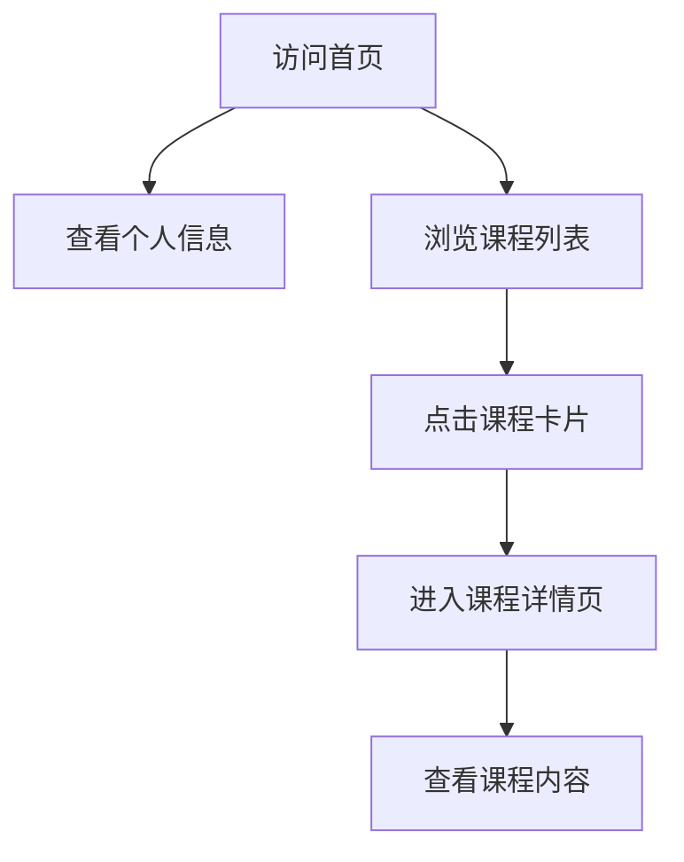

## 1. Product Overview
个人学生页面，展示梁晓晴的个人信息和课程列表，后续可补充课程内容。
- 主要目的是作为个人学习资料的集中展示平台，方便后续补充和查看课程内容
- 目标用户为学生本人和可能的访问者，展示学习成果和课程信息

## 2. Core Features

### 2.1 User Roles
| 角色 | 注册方式 | 核心权限 |
|------|---------------------|------------------|
| 访问者 | 无需注册 | 浏览页面内容 |
| 管理员 | 本地文件编辑 | 更新页面内容 |

### 2.2 Feature Module
1. **首页**: 个人信息展示、课程列表、导航栏
2. **课程详情页**: 课程内容展示（后续补充）

### 2.3 Page Details
| 页面名称 | 模块名称 | 功能描述 |
|-----------|-------------|---------------------|
| 首页 | 个人信息区 | 展示学生姓名、学校、专业等基本信息 |
| 首页 | 课程列表区 | 展示所有课程卡片，包含课程名称和简介 |
| 首页 | 导航栏 | 提供页面导航功能 |
| 课程详情页 | 课程内容区 | 展示具体课程的详细内容（后续补充） |

## 3. Core Process
用户访问首页，查看个人信息和课程列表，点击课程卡片进入课程详情页查看详细内容。

## 4. User Interface Design
### 4.1 Design Style
- 主色调：蓝色系 (#165DFF) 和白色 (#FFFFFF)
- 辅助色：浅灰色 (#F5F7FA) 和深灰色 (#333333)
- 按钮样式：圆角按钮，有悬停效果
- 字体：无衬线字体，标题使用较大字号
- 布局风格：卡片式布局，响应式设计
- 图标风格：简约线性图标

### 4.2 Page Design Overview
| 页面名称 | 模块名称 | UI元素 |
|-----------|-------------|-------------|
| 首页 | 个人信息区 | 居中布局，包含头像、姓名、学校、专业信息，使用大标题和副标题 |
| 首页 | 课程列表区 | 网格布局，每个课程为一个卡片，包含课程名称和简短描述，有悬停效果 |
| 首页 | 导航栏 | 顶部固定导航栏，包含页面标题和导航链接 |
| 课程详情页 | 课程内容区 | 左侧导航，右侧内容区，包含课程介绍、章节内容等 |

### 4.3 Responsiveness
- 桌面优先设计，适配移动设备
- 在小屏幕上课程卡片从网格布局变为单列布局
- 导航栏在移动设备上变为汉堡菜单

### 4.4 3D Scene Guidance
- 无3D场景需求