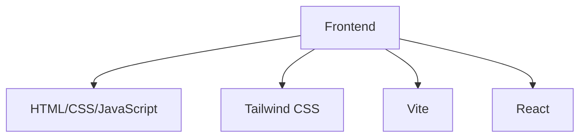

## 1. Architecture Design


## 2. Technology Description
- Frontend: React@18 + Tailwind CSS@3 + Vite
- Initialization Tool: Vite
- Backend: None (纯静态页面)
- Database: None (纯静态页面)

## 3. Route Definitions
| 路由 | 用途 |
|-------|---------|
| / | 首页，展示个人信息和课程列表 |
| /courses/:id | 课程详情页，展示具体课程内容 |

## 4. API Definitions
- 无API定义，纯静态页面

## 5. Server Architecture Diagram
- 无服务器架构，纯静态页面

## 6. Data Model
- 无数据模型，使用静态数据

### 6.1 静态数据结构
```javascript
// 个人信息
const personalInfo = {
  name: "梁晓晴",
  school: "广东科学技术职业学院",
  department: "商学院",
  major: "商务数据分析与应用"
};

// 课程列表
const courses = [
  {
    id: "python-basics",
    name: "Python基础",
    description: "Python编程语言的基础语法和应用"
  },
  {
    id: "data-analysis",
    name: "数据分析与应用",
    description: "使用Python进行数据分析的方法和实践"
  },
  {
    id: "data-collection",
    name: "数据采集与处理",
    description: "网络数据采集和数据预处理技术"
  },
  {
    id: "supply-chain-analysis",
    name: "供应链数据分析",
    description: "供应链管理中的数据分析方法"
  },
  {
    id: "database-principles",
    name: "数据库原理与应用",
    description: "数据库的基本原理和应用技术"
  }
];
```